## Introdução {.sem-logo}

:::: {.fragment .fade-in}
::: {.callout-tip appearance="minimal"}
## Delimitação do Tema

Este projeto de pesquisa se propõe a estudar a relação entre a **sofisticação da estrutura produtiva** e a **desigualdade de renda** no nível das ***Regiões Imediatas*** no Brasil no mercado de trabalho formal, através dos microdados da Relação Anual de Informações Sociais (**RAIS**) fornecidos pelo Ministério do Trabalho e Emprego, no período de **2003 a 2023**.
:::
::::

\

:::: {.fragment .fade-in}
::: blackbox
> A **complexidade econômica** captura informações sobre o nível de desenvolvimento de uma economia que são relevantes para as maneiras pelas quais uma economia gera e **distribui sua renda**. Além disso, (...) a ***estrutura produtiva de um país pode limitar sua extensão de desigualdade de renda***. (Hartmann et al., 2017)
:::
::::

## Introdução {.sem-logo}

\

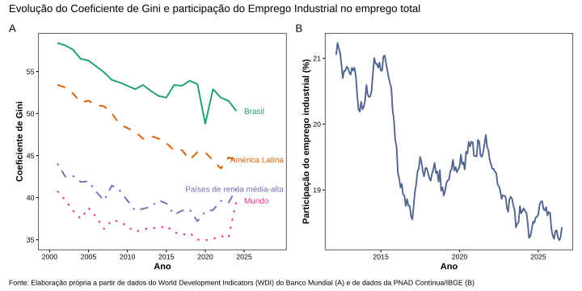{width="90%" fig-align="center"}

## Introdução {.sem-logo}

{fig-align="center"}

## Arcabouço Teórico {.sem-logo}

:::::::::::::::: {.fragment .fade-in}
::::::::::::::: {.columns style="display: flex;"}
:::::: {.column width="33.33%" style="display: flex;"}
::::: {.callout-warning appearance="minimal" title="Estruturalistas" style="flex-grow: 1; margin: 5px;"}
:::: {.fragment .fade-in}
::: nonincremental
-   **Raul Prebisch** e **Celso Furtado**
-   Tese **Centro-Periferia**
-   Deterioração dos **termos de troca**
-   Mudança **estrutural**
-   Transferência de Mão de Obra
-   **Industrialização** como Sofisticação Produtiva
:::
::::
:::::
::::::

:::::: {.column width="33.33%" style="display: flex;"}
::::: {.callout-important appearance="minimal" title="Novo Desenvolvimentismo" style="flex-grow: 1; margin: 5px;"}
:::: {.fragment .fade-in}
::: nonincremental
-   Focado em países de **Renda Média**
-   Rejeição da **Poupança externa**
-   **Doença Holandesa**
-   Equilíbrio dos 5 preços macroeconômicos: **Taxa de juros**, **Taxa de Câmbio**, **Salários**, **Lucros** e **Inflação**
-   Neutralização Cambial
:::
::::
:::::
::::::

:::::: {.column width="33.33%" style="display: flex;"}
::::: {.callout-tip appearance="minimal" title="Complexidade Econômica" style="flex-grow: 1; margin: 5px;"}
:::: {.fragment .fade-in}
::: nonincremental
-   Proposta por **Hidalgo** e **Hausmann**
-   Use de **Redes Complexas**
-   Dados de **Comércio Internacional**
-   Índice de Complexidade Econômica (**ICE**)
-   **Diversidade**
-   **Ubiquidade**
:::
::::
:::::
::::::
:::::::::::::::
::::::::::::::::

:::::: {.fragment .fade-in}
::::: {.callout-note width="99.99%" appearance="minimal" title="Dialogo"}
:::: {.fragment .fade-in}
::: nonincremental
1.  O desenvolvimento econômico como **mudança estrutural**
2.  A concepção de **centro-periferia**
3.  A **doença holandesa** como perda de complexidade econômica
4.  A perspectiva de países de **renda média** como **medianamente complexos**
5.  A atuação do Estado como **indutor** do desenvolvimento e da complexificação econômica
:::
::::
:::::
::::::

## O que é uma região imediata? {.sem-logo}

:::: {.fragment .fade-in}
::: {.callout-note appearance="minimal" title="Regiões Imediatas"}
A **Região Geográfica Imediata** é definida pelo **IBGE (2017)** como uma divisão regional que tem a *rede urbana* como seu principal elemento de referência. Elas foram estruturadas a partir de centros urbanos próximos para atender às **necessidades imediatas** das populações como o fluxo de pessoas em busca de **trabalho**, **serviços de saúde**, **educação**, **compras** e **serviços públicos**.
:::
::::

:::::::: {.fragment .fade-in}
::::::: {.columns style="display: flex;"}
:::: {.column width="50%" style="display: flex;"}
::: {.callout-warning appearance="minimal" title="Rede Urbana" style="flex-grow: 1; margin: 5px;"}
A **rede urbana** (ou rede de cidades) é o sistema articulado formado pelos centros urbanos e pelas infraestruturas de transporte e comunicação que os interligam, por onde circulam fluxos materiais e imateriais de pessoas, bens, serviços e decisões.
:::
::::

:::: {.column width="50%" style="display: flex;"}
::: {.callout-warning appearance="minimal" title="Características" style="flex-grow: 1; margin: 5px;"}
Respeita o limite da unidade federativa e é constituída por 5 a 25 municípios e com população de no mínimo 50.000 habitantes. Se organiza ao redor de um centro urbano principal (uma **cidade-polo**), que pode ser um município ou um arranjo populacional (áreas conurbadas).
:::
::::
:::::::
::::::::

:::: {.fragment .fade-in}
::: {.callout-important appearance="minimal" title="Vantagem"}
O Brasil é divido em **510 regiões imediatas** que consideradas ao longo do período de **2003-2023** vão representar **10.710 observações**. A análise com base em uma agregação intermediária como as regiões imediatas, que representam regiões interconectadas, pode permitir identificar oportunidades não reveladas em dados nacionais ou estaduais.
:::
::::

## Plataforma Dataviva {.sem-logo}

:::::::::::: {.fragment .fade-in}
::::::::::: {.columns style="display: flex;"}
::::::::: {.column width="30%"}
:::: {.fragment .fade-in}
::: {.callout-warning appearance="minimal" title="ICE-R"}
Proposto por Freitas (2019), utiliza dados da **RAIS**, refletindo as capacidades produtivas presentes no território, permitindo incluir também na medida serviços não comercializáveis e manufaturas destinadas ao mercado interno.
:::
::::

:::: {.fragment .fade-in}
::: {.callout-important appearance="minimal" title="ICA-R"}
Possibilita identificar a sofisticação de 670 atividades econômicas (**CNAE**) presentes na RAIS.
:::
::::

:::: {.fragment .fade-in}
::: {.callout-tip appearance="minimal" title="Espaço de Atividade"}
Construído a partir de uma adaptação do *Product Space*, que permite mapear a proximidade entre atividades econômicas com base na similaridade de habilidades requeridas entre diferentes setores.
:::
::::
:::::::::

::: {.column width="70%" style="display: flex;"}
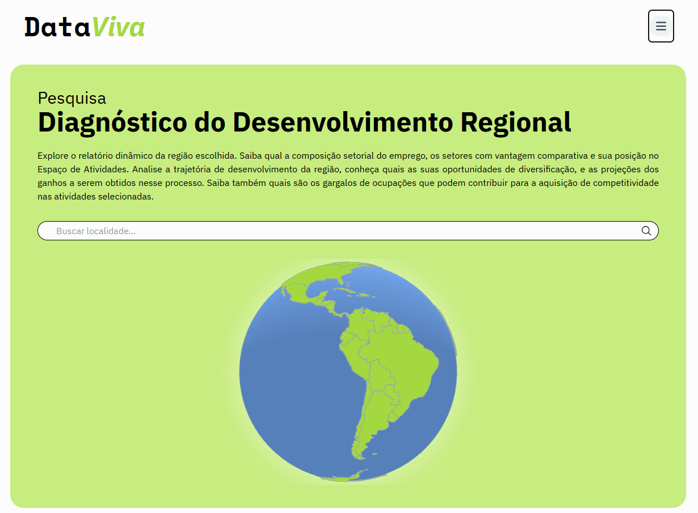{.absolute top="100" left="500" width="500" height="350"}

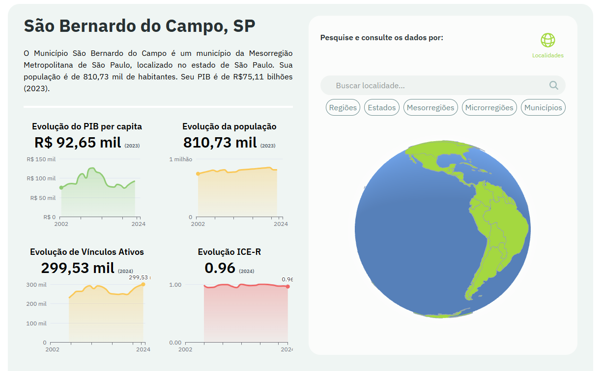{.absolute .fragment top="150" left="520" width="500" height="350"}

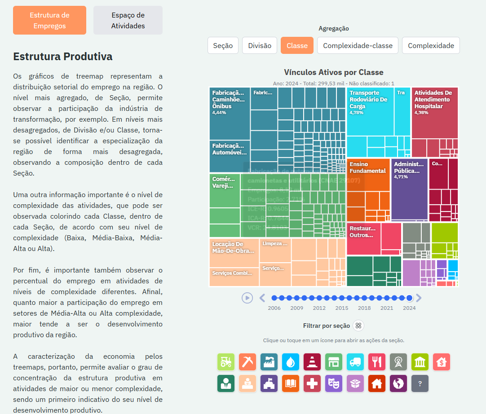{.absolute .fragment top="200" left="540" width="500" height="350"}

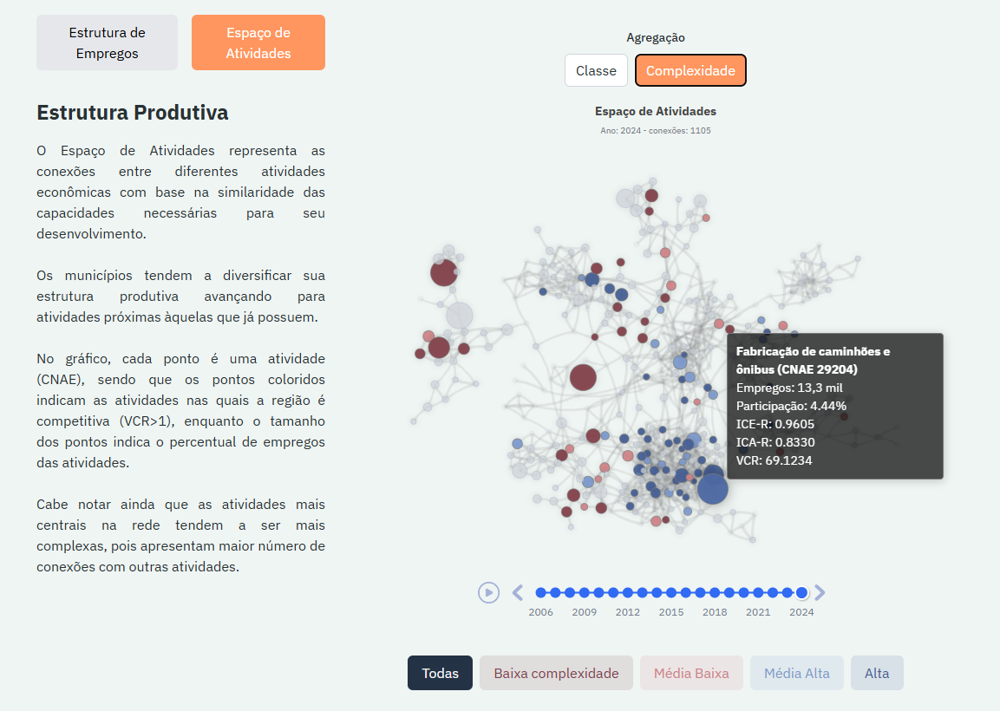{.absolute .fragment top="250" left="560" width="500" height="350"}
:::
:::::::::::
::::::::::::

## Objetivos e Hipóteses {.sem-logo}

:::: {.fragment .fade-in}
::: {.blackbox .font-small}
 *Geral:*

Apresentar o conceito de complexidade econômica e o indicador ICE-R, que traduz a sofisticação da estrutura produtiva regional. Traçar um paralelo entre a teoria da complexidade econômica e a teoria Estruturalista/Novo Desenvolvimentista, demonstrando a importância da estrutura produtiva, em especial do **setor industrial**, no desenvolvimento e na distribuição de renda regional. Por fim, através de dados das **regiões imediatas** brasileiras para o período **2003-2023**, investigar a relação entre o ICE-R e o coeficiente de Gini.
:::
::::

\

:::: {.fragment .fade-in}
::: {.blackbox .font-small}
 *Hipótese:*

Partimos da hipótese de que a complexidade econômica regional se relaciona negativamente com a desigualdade de renda , ou seja, ***a complexidade reduz a desigualdade nas regiões imediatas*** no Brasil. De acordo com a literatura há evidências de que essa relação pode ser heterogênea de acordo com a região.
:::
::::

## Revisão da Literatura {.sem-logo .smaller}

::: {style="font-size: 70%;"}

| Autores                      | Objetivo                                                                                                                                                                                                                       | Metodologia                                                                                                                                                                                                           | Dados                                                                                                                                                                                                                                                                                                           | Resultados                                                                                                                                                                                                                                                                                                                                                                                                                                       |
| ---------------------------- | ------------------------------------------------------------------------------------------------------------------------------------------------------------------------------------------------------------------------------ | --------------------------------------------------------------------------------------------------------------------------------------------------------------------------------------------------------------------- | --------------------------------------------------------------------------------------------------------------------------------------------------------------------------------------------------------------------------------------------------------------------------------------------------------------- | ------------------------------------------------------------------------------------------------------------------------------------------------------------------------------------------------------------------------------------------------------------------------------------------------------------------------------------------------------------------------------------------------------------------------------------------------ |
| Hartmann et al. (2017)       | Examinar a relação entre complexidade econômica e desigualdade de renda (Gini) entre países.                                                                                                                                   | Pooled cross-sectional regression, Fixed-effects panel regression                                                                                                                                                     | PIB per capita e seu termo quadrático, anos de escolaridade, população, variáveis institucionais. Fontes: ECI, Gini.                                                                                                                                                                                            | A complexidade econômica (ECI) teve um efeito negativo na desigualdade de renda (Gini), indicando que maior complexidade está associada a menor desigualdade.                                                                                                                                                                                                                                                                                    |
| Lee e Vu (2020)              | Investigar a relação entre a complexidade econômica e a desigualdade de renda (Gini), testando o efeito moderador do capital humano e riscos institucionais.                                                                   | Regressão OLS cross-country (109 países) e estimador system GMM (painel dinâmico de 113 países em períodos de 5 anos entre 1965-2014).                                                                                | Gini (SWIID); ECI (MIT/OEC); Capital Humano/Escolaridade (Barro e Lee, 2013); PIB per capita (Banco Mundial); Regra de Direito (Dahlberg et al., 2016).                                                                                                                                                         | Relação condicional: a análise OLS indicou correlação negativa (menor Gini), potencializada pelo capital humano. O modelo GMM revelou que o aumento da complexidade pode elevar a desigualdade no curto e longo prazo devido ao viés de habilidades.                                                                                                                                                                                             |
| Gosh et al. (2023)           | Explorar o nexo dinâmico entre a transformação estrutural (complexidade econômica) e a desigualdade de renda sob a hipótese da Curva de Kuznets.                                                                               | Análise de dados em painel dinâmico utilizando a técnica System-GMM (Generalized Method of Moments), com modelos que tratam questões de heterogeneidade e endogeneidade.                                              | Gini (World Income Inequality Databank), PIB per capita (WDI), Índice de Complexidade Econômica (Atlas Media), Urbanização e Abertura Comercial (WDI). Abrange 65 países (1990–2015).                                                                                                                           | A complexidade econômica tem efeito negativo significativo na desigualdade (correlação negativa), melhorando a distribuição de renda. O impacto é maior em países de baixa renda. A urbanização e a abertura comercial também reduzem a desigualdade, enquanto a crise de 2008 a aumentou.                                                                                                                                                       |
| Bandeira Morais et al.(2021) | Verificar se a estrutura produtiva regional afeta a desigualdade de renda nos estados brasileiros.                                                                                                                             | Pooled OLS, Random-effects regression                                                                                                                                                                                 | PIB per capita e termo quadrático, anos de escolaridade, população,  participação do setor agrícola, urbanização. Fontes: ECI e seu termo quadrático, Gini, Theil.                                                                                                                                              | Encontrou uma relação em formato de U invertido entre a complexidade econômica e a desigualdade de renda.                                                                                                                                                                                                                                                                                                                                        |
| Smolski et al. (2024)        | Investigar a influência da complexidade econômica e da proximidade (relatedness) sobre a desigualdade regional de renda no Brasil.                                                                                             | Análise de dados de emprego para 558 microrregiões (2002-2020) utilizando regressão de painel com efeitos fixos (FE) e GMM-DIFF.                                                                                      | ECI, Densidade de Relatedness (RD), Gini, Densidade Populacional, Escolaridade (Superior). Fontes: RAIS (Ministério do Trabalho), IBGE e COMEXSTAT.                                                                                                                                                             | Relação negativa: o aumento da complexidade e da relatedness reduz a desigualdade de renda (Gini). O efeito foi mais expressivo em regiões com maior desigualdade inicial.                                                                                                                                                                                                                                                                       |
| Freitas et al. (2025)        | Investigar se o aumento da complexidade econômica está associado à redução da desigualdade de renda nas unidades federativas do Brasil, testando a hipótese de que a desigualdade diminui à medida que a complexidade aumenta. | Modelo linear de Efeitos Fixos (EF) e análise de termo quadrático para testar não linearidade. Foram utilizadas regressões em subamostras por quartis de renda e complexidade.                                        | Variável dependente: Índice de Gini (PNADC/IBGE). Variável independente: Índice de Complexidade Econômica (ICE) (DataViva/Método dos Reflexos). Controles: PIB per capita (IBGE), População (IBGE), Abertura Comercial (COMEXSTAT), Capital Humano (PNAD), Gastos Governamentais (SICONFI). Período: 2012-2021. | Revelou uma correlação positiva estatisticamente significativa entre complexidade e desigualdade na amostra global (indica que regiões mais complexas são mais desiguais). No entanto, encontrou indícios de uma relação de U invertido (não linear), onde níveis muito altos de complexidade tendem a reduzir a desigualdade.                                                                                                                   |
:::

## Dados: Variáveis {.sem-logo}

```{r, echo=FALSE, results='asis'}
linhas <- readLines("img/tab1_dados.html", warn = FALSE)
# Remove a linha que contém DOCTYPE
linhas_limpas <- linhas[!grepl("<!DOCTYPE", linhas, ignore.case = TRUE)]
cat(linhas_limpas, sep = "\n")
```

## Dados: Estatísticas Descritivas {.sem-logo}

```{r, echo=FALSE, results='asis'}
linhas <- readLines("img/tab2_estatisticas_descritivas.html", warn = FALSE)
# Remove a linha que contém DOCTYPE
linhas_limpas <- linhas[!grepl("<!DOCTYPE", linhas, ignore.case = TRUE)]
cat(linhas_limpas, sep = "\n")
```

## Dados: Correlograma {.sem-logo}

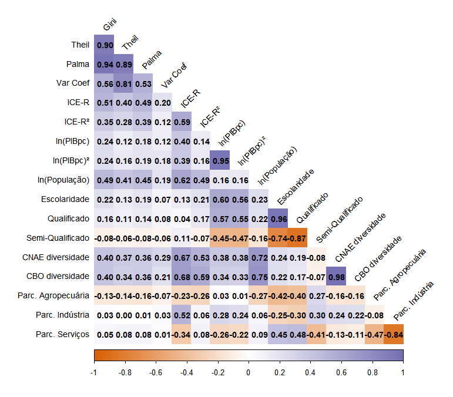{width="90%" fig-align="center"}

## Metodologia: Efeitos Fixos {.sem-logo}

::: {.fragment .fade-in}
O modelo proposto para a análise é principalmente inspirado em Saia et al. (2022), e pode ser expresso na equação abaixo:

$$
gini_{it} = \alpha_{i} + \beta_{1} \text{ICE-R}_{it} + \beta_{2} \text{ICE-R}^2_{it} + \gamma X'_{it} + \mu_{i} + \delta_{t} + \epsilon_{it}
$$
:::

:::::::::::::::: {.fragment .fade-in}
::::::::::::::: {.columns style="display: flex;"}
:::::: {.column width="33.33%" style="display: flex;"}
::::: {.callout-warning appearance="minimal" title="1 Especificação" style="flex-grow: 1; margin: 5px;"}
:::: {.fragment .fade-in}
::: nonincremental
-   $Gini$ é a desigualdade na região imediata $i$ e no período $t$;
-   $ICE-R$ e $ICE-R^2$ representam a sofisticação da estrutura produtiva;
-   $X´$ é uma matriz de covariáveis;
-   $e$ é o termo erro;
-   $\mu_{i}$ captura a heterogeneidade não observada;
-   $\delta_{t}$ captura fatores específicos não observados.
:::
::::
:::::
::::::

:::::: {.column width="33.33%" style="display: flex;"}
::::: {.callout-important appearance="minimal" title="2 Resultado esperado" style="flex-grow: 1; margin: 5px;"}
:::: {.fragment .fade-in}
::: nonincremental
-   Esperamos que coeficiente $\beta_{1}<0$, confirmando a hipótese de que a complexidade econômica reduz a desigualdade;
-   Será avaliado se a complexidade econômica se relaciona com a desigualdade de forma linear ou não através do termo $ICE-R^2$.
:::
::::
:::::
::::::

:::::: {.column width="33.33%" style="display: flex;"}
::::: {.callout-tip appearance="minimal" title="3 Controles/Fontes" style="flex-grow: 1; margin: 5px;"}
:::: {.fragment .fade-in}
::: nonincremental
-   **Básico:** ln(PIB per capta), ln(PIB per capta)², Grau de abertura (%), ln(População), Escolaridade e Parc. Agropecuária;

-   **Estendido:** Qualificado, Semi-Qualificado, CNAE e CBO diversidade e parcela de emprego na indústria e no nos serviços;
:::
::::
:::::
::::::
:::::::::::::::
::::::::::::::::

## Metodologia: System-GMM {.sem-logo}

::: {.fragment .fade-in}
O modelo proposto para a análise é principalmente inspirado em (Bandeira Morais; Swart; Jordaan, 2021), e pode ser expresso na equação abaixo:

$$
\begin{gathered}
gini_{it} = \alpha_{i} + \beta_{1}gini_{i,t-1} + \beta_{2} \text{ICE-R}_{it} + \beta_{3} \text{ICE-R}_{i,t-1} +
\\ 
 \beta_{4} \text{ICE-R}^2_{it} +  \beta_{5} \text{ICE-R}^2_{i,t-1} + \beta_{6} X'_{it} + \delta_{t} + \epsilon_{it}
\end{gathered}
$$
:::

:::::::::::::::: {.fragment .fade-in}
::::::::::::::: {.columns style="display: flex;"}
:::::: {.column width="33.33%" style="display: flex;"}
::::: {.callout-warning appearance="minimal" title="1 Especificação" style="flex-grow: 1; margin: 5px;"}
:::: {.fragment .fade-in}
::: nonincremental
-   Inclusão da defasagem da variável dependente $gini_{i,t-1}$;
-   Inclusão da defasagem da variável de interesse $\text{ICE-R}_{i,t-1}$ e seu termo quadrático $\text{ICE-R}^2_{i,t-1}$.
:::
::::
:::::
::::::

:::::: {.column width="33.33%" style="display: flex;"}
::::: {.callout-important appearance="minimal" title="2 Resultado esperado" style="flex-grow: 1; margin: 5px;"}
:::: {.fragment .fade-in}
::: nonincremental
-   Esperamos que coeficiente $\beta_{2}<0$ e $\beta_{3}<0$, confirmando a hipótese de que a complexidade econômica reduz a desigualdade;
-   Será avaliado se a complexidade econômica se relaciona com a desigualdade de forma linear ou não através do termo $ICE-R^2$ e $\text{ICE-R}^2_{i,t-1}$.
:::
::::
:::::
::::::

:::::: {.column width="33.33%" style="display: flex;"}
::::: {.callout-tip appearance="minimal" title="3 Controles/Fontes" style="flex-grow: 1; margin: 5px;"}
:::: {.fragment .fade-in}
::: nonincremental
-   **Básico:** ln(PIB per capta), ln(PIB per capta)², Grau de abertura (%), ln(População), Escolaridade e Parc. Agropecuária;

-   **Instrumentos:** $gini_{t-3}$, $\text{ICE-R}_{t-3}$, $ln(PIBpc)_{t-2}$ a $ln(PIBpc)_{t-3}$, $\text{Grau Abertura (%)}_{t-1}$ a $\text{Grau Abertura (%)}_{t-3}$, $ln(População)_{t-1}$ a $ln(População)_{t-2}$, $Escolaridade_{t-1}$, $\text{Parc. Agro}_{t-2}$ a $\text{Parc. Agro}_{t-3}$.
:::
::::
:::::
::::::
:::::::::::::::
::::::::::::::::

## Modelo Base - EF {.sem-logo}

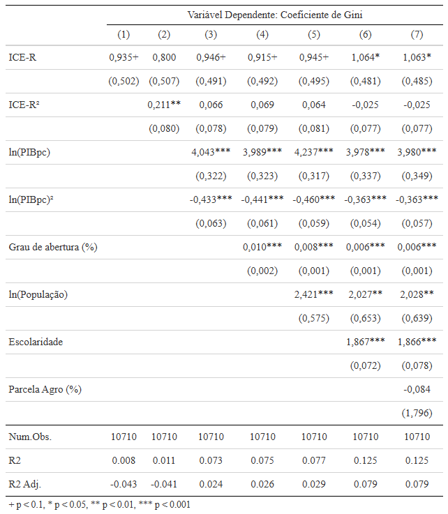{fig-align="center"}

## Modelo Estendido - EF {.sem-logo}

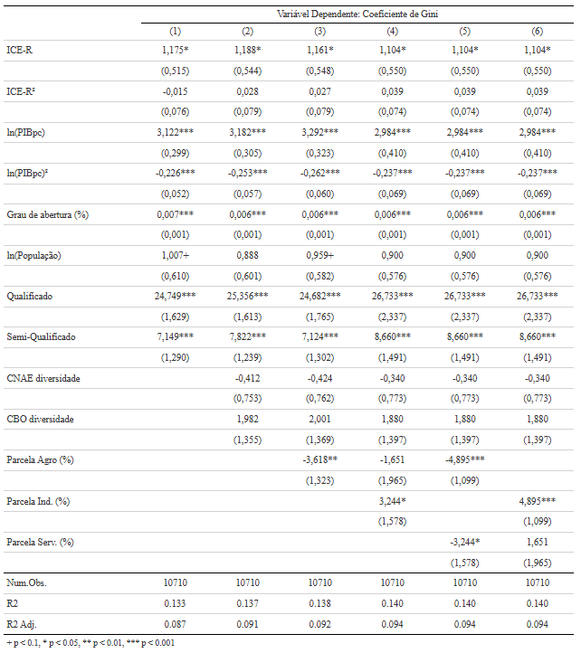{fig-align="center"}

## Robustez - Medidas Alternativas {.sem-logo}

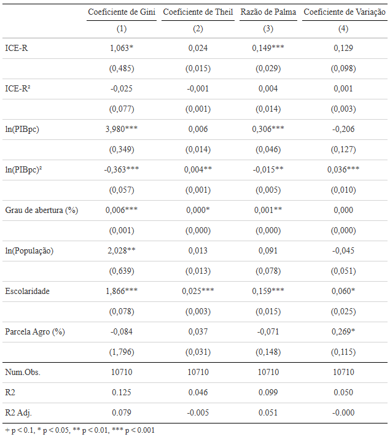{fig-align="center"}

## Robustez - Sub-amostras {.sem-logo}

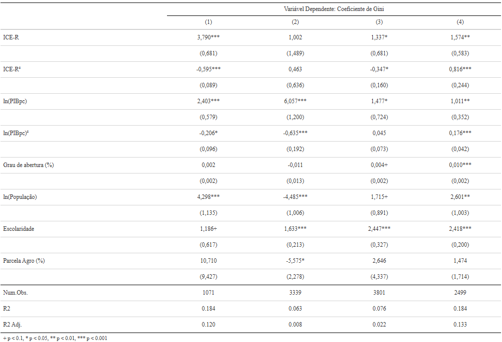{fig-align="center"}

## Robustez - System-GMM {.sem-logo}

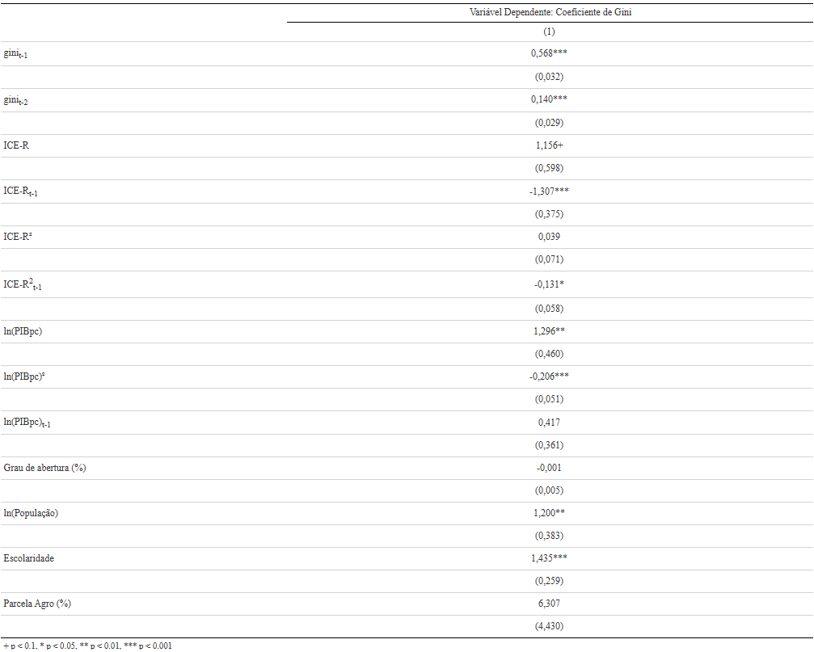{fig-align="center"}

## Considerações Finais {.sem-logo}

-   [**Proposta:** Estudar a relação entre a *complexidade econômica* e a *desigualdade de renda* no **mercado formal de trabalho** nas **regiões imediatas** do Brasil no período de **2003 a 2023**, através dos **microsdados da RAIS**;]{.font-small}

-   [**Arcabouço Teórico:** Estruturalismo Latino-Americano, o Novo Desenvolvimentismo e a Complexidade econômica;]{.font-small}

-   [**Resultados Preliminares - Efeitos Fixos:**]{.font-small}

1.  [Relação *positiva* entre a complexidade econômica e a desigualdade de renda;]{.font-small}
2.  [Resultado se manteve *consistente* a mudanças na especificação, a diferentes medidas de desigualdade;]{.font-small}
3.  [No entanto, o efeito pode ser *heterogêneo* a depender da amostra utilizada;]{.font-small}

-   [**Resultados Preliminares - Painel Dinâmico:**]{.font-small}

1.  [A desigualdade de renda é *persistente*;]{.font-small}
2.  [ICE-R contemporâneo se manteve *positivo*, assim como no modelo de efeitos fixos;]{.font-small}
3.  [ICE-R defasado e seu termo quadrático apresentaram coeficientes *negativos* e estatisticamente significantes indicando que *no curto prazo o aumento da complexidade pode aumentar ligeiramente a desigualdade, mas com o passar do tempo a tendência é reduzir a desigualdade de renda*, comprovando a hipótese inicial.]{.font-small}

## Próximos Passos {.sem-logo}

-   Seção 3 do capítulo 2 apresentando do diálogo entre as escolas apresentadas como arcabouço teórico;

-   Capítulo 3 com a análise exploratória;

-   Explorar diferentes variáveis e modelos na análise empírica do capítulo 4.

# Obrigado! {.sem-logo}
